# Rapid7 InsightVM Database ERD

## Entity Relationship Diagram for Rapid7 InsightVM SQL Query Export Schema

This document provides a visual representation of the database schema relationships using Mermaid diagrams.

---

## Core Schema Overview

### Primary Entities

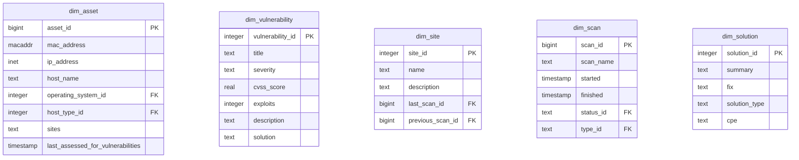

### Core Relationships

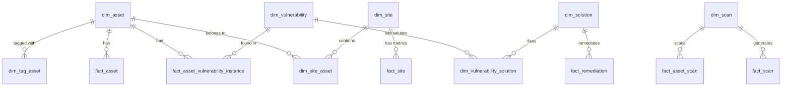

---

## Detailed Entity Relationships

### Asset Management

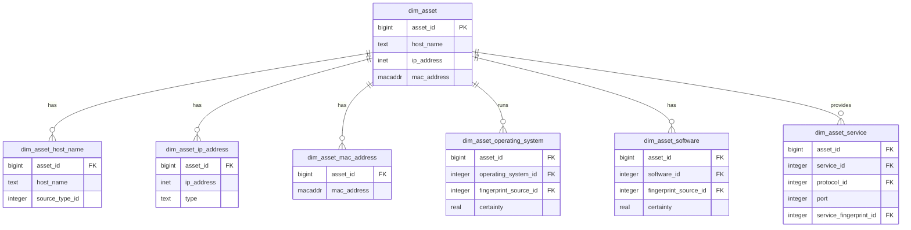

### Vulnerability Management

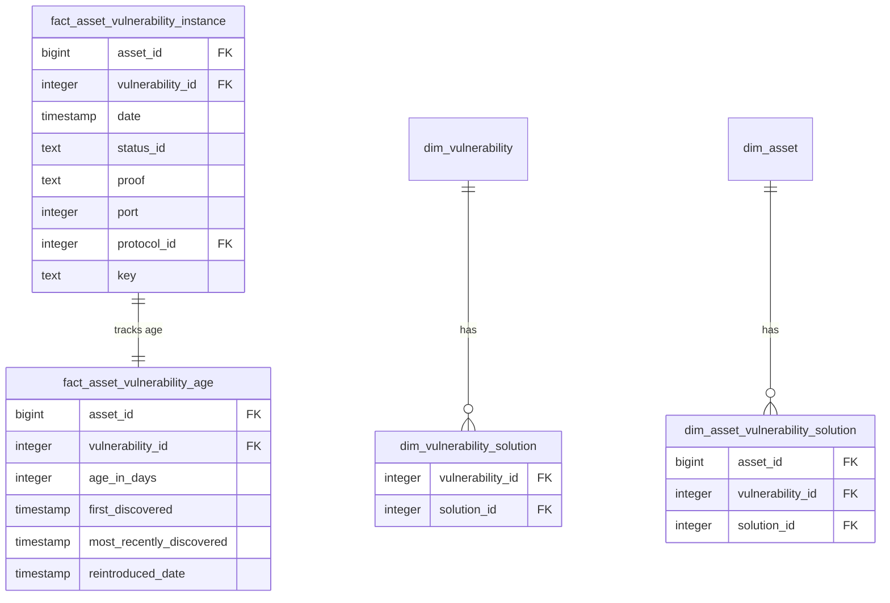

### Policy & Compliance

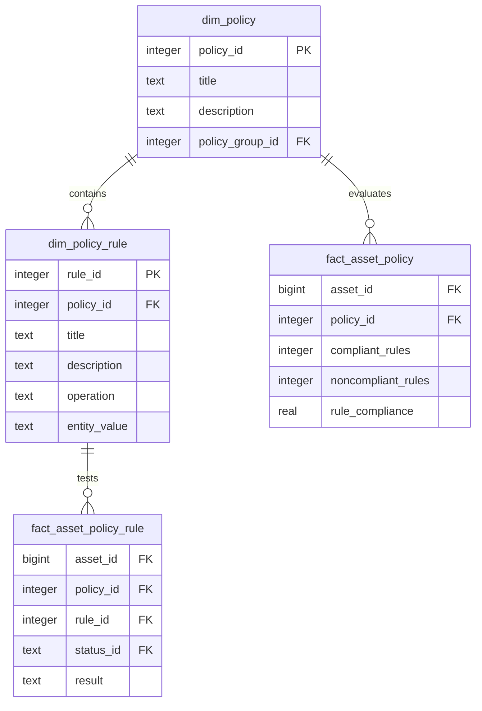

### Exception Management

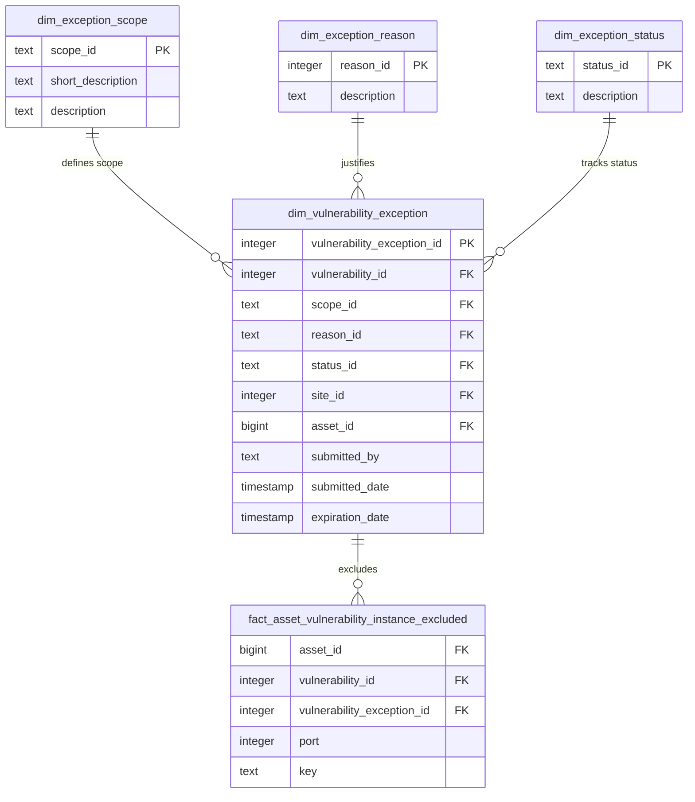

---

## Fact Tables Overview

### Transaction Facts (Scan-based)

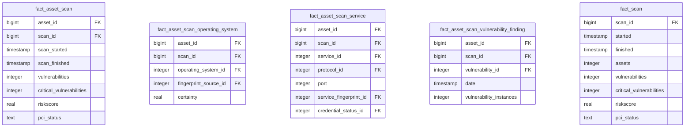

### Accumulating Snapshots (Current State)

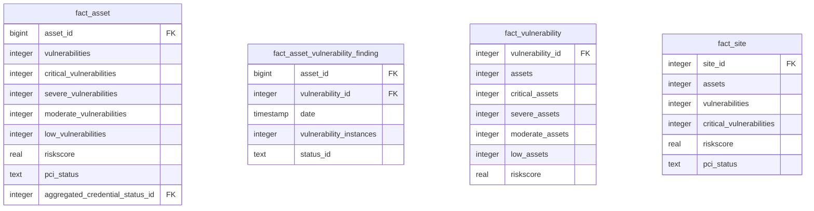

---

## Key Relationship Patterns

### Many-to-Many Relationships

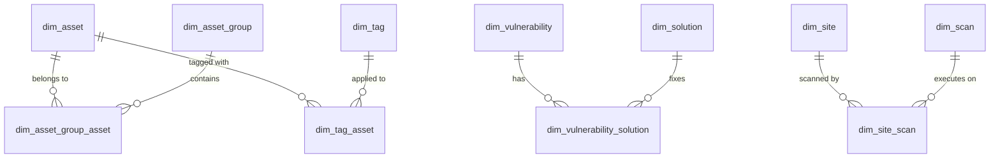

### Lookup Tables

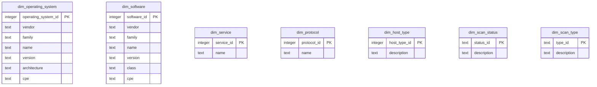

---

## Usage Patterns

### Common Query Patterns

1. **Asset Inventory**: `dim_asset` → `dim_asset_*` (host names, IPs, OS, software)
2. **Vulnerability Analysis**: `fact_asset_vulnerability_instance` → `dim_vulnerability`
3. **Compliance Reporting**: `fact_asset_policy` → `dim_policy` → `dim_policy_rule`
4. **Scan Results**: `fact_asset_scan` → `dim_scan` → `dim_site`
5. **Remediation Planning**: `fact_remediation()` function → `dim_solution`

### Performance Considerations

- **Primary Keys**: All tables have proper primary keys
- **Foreign Keys**: Relationships are properly indexed
- **Fact Tables**: Use for aggregations and counts
- **Dimension Tables**: Use for filtering and grouping
- **Bridge Tables**: Handle many-to-many relationships

---

## Related Documentation

- **[COMPLETE_TABLE_REFERENCE.md](COMPLETE_TABLE_REFERENCE.md)** - Complete field documentation
- **[QUICK_TABLE_LOOKUP.md](QUICK_TABLE_LOOKUP.md)** - Quick reference guide

---

## Complete Schema Map

**Warning: This is a comprehensive view of all 89 tables and their relationships. It's complex but useful for understanding the complete data model.**

### Core Entities & Primary Relationships

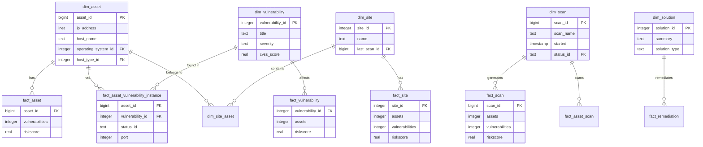

### Asset Detail Tables

```mermaid
erDiagram
    dim_asset {
        bigint asset_id PK
        inet ip_address
        text host_name
    }
    
    dim_asset_host_name {
        bigint asset_id FK
        text host_name
    }
    
    dim_asset_ip_address {
        bigint asset_id FK
        inet ip_address
        text type
    }
    
    dim_asset_mac_address {
        bigint asset_id FK
        macaddr mac_address
    }
    
    dim_asset_operating_system {
        bigint asset_id FK
        integer operating_system_id FK
        real certainty
    }
    
    dim_asset_software {
        bigint asset_id FK
        integer software_id FK
        real certainty
    }
    
    dim_asset_service {
        bigint asset_id FK
        integer service_id FK
        integer port
    }
    
    dim_asset_container {
        bigint asset_id FK
        text container_id
        text name
    }
    
    dim_asset_file {
        bigint asset_id FK
        text name
        bigint size
    }
    
    dim_asset_user_account {
        bigint asset_id FK
        text name
    }
    
    %% Asset Detail Relationships
    dim_asset ||--o{ dim_asset_host_name : "has"
    dim_asset ||--o{ dim_asset_ip_address : "has"
    dim_asset ||--o{ dim_asset_mac_address : "has"
    dim_asset ||--o{ dim_asset_operating_system : "runs"
    dim_asset ||--o{ dim_asset_software : "has"
    dim_asset ||--o{ dim_asset_service : "provides"
    dim_asset ||--o{ dim_asset_container : "contains"
    dim_asset ||--o{ dim_asset_file : "has"
    dim_asset ||--o{ dim_asset_user_account : "has"
```

### Vulnerability Management Tables

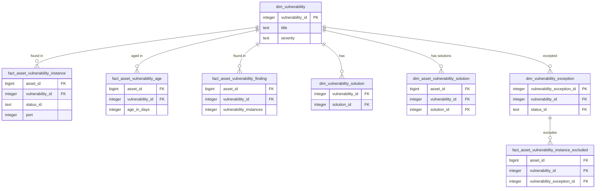

### Policy & Compliance Tables

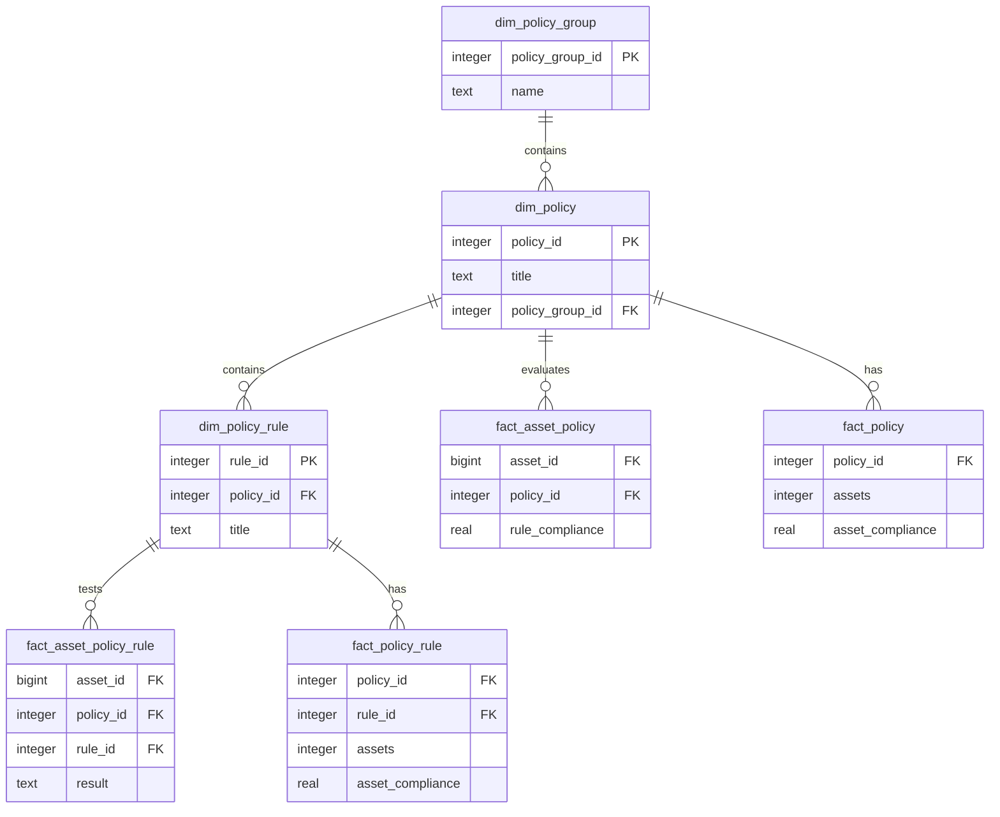

### Scan & Discovery Tables

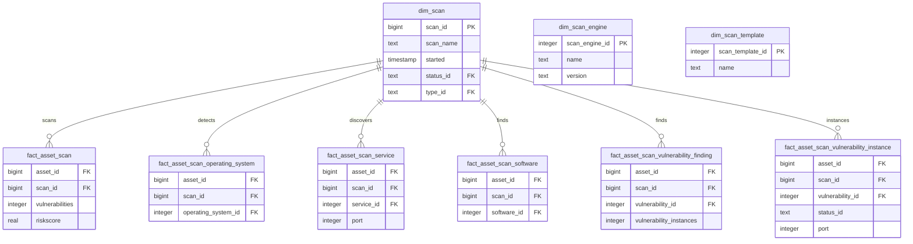

### Lookup & Reference Tables

```mermaid
erDiagram
    dim_operating_system {
        integer operating_system_id PK
        text vendor
        text family
        text name
        text version
    }
    
    dim_software {
        integer software_id PK
        text vendor
        text family
        text name
        text version
    }
    
    dim_service {
        integer service_id PK
        text name
    }
    
    dim_protocol {
        integer protocol_id PK
        text name
    }
    
    dim_host_type {
        integer host_type_id PK
        text description
    }
    
    dim_scan_status {
        text status_id PK
        text description
    }

    dim_scan_type {
        text type_id PK
        text description
    }
    
    dim_fingerprint_source {
        integer fingerprint_source_id PK
        text source
    }
    
    dim_credential_status {
        integer credential_status_id PK
        text credential_status_description
    }
    
    dim_vulnerability_status {
        text status_id PK
        text description
    }
    
    dim_exception_scope {
        text scope_id PK
        text description
    }
    
    dim_exception_reason {
        integer reason_id PK
        text description
    }
    
    dim_exception_status {
        text status_id PK
        text description
    }
    
    dim_tag {
        integer tag_id PK
        text name
        text type
    }
    
    dim_asset_group {
        integer asset_group_id PK
        text name
        bool dynamic_membership
    }
    
    %% Lookup Relationships
    dim_operating_system ||--o{ dim_asset : "primary"
    dim_software ||--o{ dim_asset_software : "installed"
    dim_service ||--o{ dim_asset_service : "provided"
    dim_protocol ||--o{ dim_asset_service : "uses"
    dim_host_type ||--o{ dim_asset : "classified as"
    dim_scan_status ||--o{ dim_scan : "status"
    dim_scan_type ||--o{ dim_scan : "type"
    dim_fingerprint_source ||--o{ dim_asset_operating_system : "sources"
    dim_credential_status ||--o{ dim_asset_service_credential : "status"
    dim_vulnerability_status ||--o{ fact_asset_vulnerability_instance : "status"
    dim_exception_scope ||--o{ dim_vulnerability_exception : "scopes"
    dim_exception_reason ||--o{ dim_vulnerability_exception : "justifies"
    dim_exception_status ||--o{ dim_vulnerability_exception : "status"
    dim_tag ||--o{ dim_tag_asset : "applied to"
    dim_asset_group ||--o{ dim_asset_group_asset : "contains"
```

### Bridge & Junction Tables

```mermaid
erDiagram
    dim_site_asset {
        integer site_id FK
        bigint asset_id FK
    }
    
    dim_tag_asset {
        integer tag_id FK
        bigint asset_id FK
        text source
    }
    
    dim_asset_group_asset {
        integer asset_group_id FK
        bigint asset_id FK
    }
    
    dim_site_scan {
        integer site_id FK
        bigint scan_id FK
    }
    
    dim_site_scan_config {
        integer site_id FK
        integer scan_template_id FK
        integer scan_engine_id FK
    }
    
    dim_vulnerability_solution {
        integer vulnerability_id FK
        integer solution_id FK
    }
    
    dim_asset_vulnerability_solution {
        bigint asset_id FK
        integer vulnerability_id FK
        integer solution_id FK
    }
    
    dim_asset_vulnerability_best_solution {
        bigint asset_id FK
        integer vulnerability_id FK
        integer solution_id FK
    }
    
    %% Bridge Relationships
    dim_site_asset }o--|| dim_site : "belongs to"
    dim_site_asset }o--|| dim_asset : "contains"
    
    dim_tag_asset }o--|| dim_tag : "applied to"
    dim_tag_asset }o--|| dim_asset : "tagged with"
    
    dim_asset_group_asset }o--|| dim_asset_group : "contains"
    dim_asset_group_asset }o--|| dim_asset : "grouped in"
    
    dim_site_scan }o--|| dim_site : "scanned by"
    dim_site_scan }o--|| dim_scan : "executes on"
    
    dim_vulnerability_solution }o--|| dim_vulnerability : "has"
    dim_vulnerability_solution }o--|| dim_solution : "fixes"
    
    dim_asset_vulnerability_solution }o--|| dim_asset : "has"
    dim_asset_vulnerability_solution }o--|| dim_vulnerability : "has"
    dim_asset_vulnerability_solution }o--|| dim_solution : "solves"
```

### Additional Fact Tables

```mermaid
erDiagram
    fact_asset_discovery {
        bigint asset_id FK
        timestamp first_discovered
        timestamp last_discovered
    }
    
    fact_asset_group {
        integer asset_group_id FK
        integer assets
        integer vulnerabilities
        real riskscore
    }
    
    fact_asset_policy_rule_check {
        bigint asset_id FK
        integer policy_id FK
        integer rule_id FK
        text result
    }
    
    fact_asset_scan_policy {
        bigint asset_id FK
        bigint scan_id FK
        integer policy_id FK
        real rule_compliance
    }
    
    fact_policy_rule {
        integer policy_id FK
        integer rule_id FK
        integer assets
        real asset_compliance
    }
    
    fact_remediation {
        integer solution_id FK
        integer assets
        integer vulnerabilities
        real riskscore
    }
    
    fact_tag {
        integer tag_id FK
        integer assets
        integer vulnerabilities
        real riskscore
    }
    
    fact_all {
        integer assets
        integer vulnerabilities
        real riskscore
    }
    
    %% Additional Fact Relationships
    fact_asset_discovery }o--|| dim_asset : "tracks"
    fact_asset_group }o--|| dim_asset_group : "summarizes"
    fact_asset_policy_rule_check }o--|| dim_asset : "checks"
    fact_asset_scan_policy }o--|| dim_asset : "evaluates"
    fact_asset_scan_policy }o--|| dim_scan : "during"
    fact_policy_rule }o--|| dim_policy : "summarizes"
    fact_policy_rule }o--|| dim_policy_rule : "summarizes"
    fact_remediation }o--|| dim_solution : "tracks"
    fact_tag }o--|| dim_tag : "summarizes"
```

---
